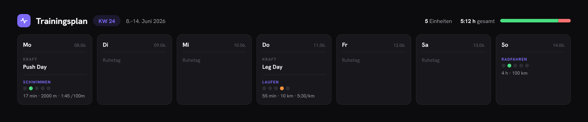

# Trainingsplanung

Wochentrainingsplaner-Web-App: Trainingswochen (Mo–So) mit Kraft- und Ausdauerblöcken planen, als Live-Vorschau ansehen und als PNG exportieren — alles in einer einzigen HTML-Datei, ohne Build-Schritt.




## Features

### Planung
- **Mehrwochen-Verwaltung**: Kalenderwochen-Picker mit Vor/Zurück-Navigation und „Heute"-Sprung; jede Woche wird separat gespeichert
- **7 aufklappbare Tageskarten** (Montag–Sonntag) mit Badges für geplante Einheiten:
  - **Kraftblock**: Titel (z. B. Push / Pull / Legs) + optionale Notiz
  - **Ausdauerblock**: beliebig viele Einheiten mit Sportart-Chips (Schwimmen / Rad / Laufen / Sonstiges), Titel, Intensität (5-Punkte-Skala), Dauer, Strecke (m bzw. km je Sportart), Pace, Label und Notiz
- **Pace-Vorauswahl**: Beim Wählen der Sportart wird ein typischer Richtwert vorbelegt (Laufen `5:10 /km`, Rad `32 km/h`, Schwimmen `1:45 /100m`) — eigene Eingaben werden nie überschrieben
- **Koppeltraining**: Toggle zwischen zwei aufeinanderfolgenden Ausdauereinheiten

### Übersicht & Export
- **Wochenübersicht**: Kacheln für Einheiten und Gesamtzeit plus Verteilungsbalken leicht / mittel / hart
- **Live-Vorschau** als 7-Spalten-Grid, leere Tage werden ausgeblendet
- **Zwei PNG-Exportformate** via `html2canvas`:
  - **Wide** (1500 px) für Desktop/Druck
  - **Story** (540×960 px, 9:16) für Instagram & Co.

### Design
- **Liquid Glass / Glassmorphism**: halbtransparente Karten mit `backdrop-filter`-Blur, Glaskanten und Taschenlampen-Effekt, der dem Cursor folgt
- **Dark- & Light-Theme** (Umschalter im Header, wird gespeichert)
- **Design-Varianten** (Pure / Athletic / Soft) mit eigenen Fonts und Radien, **4 Akzentfarben** und **Hintergrund-Modi** (Aurora mit langsamem Drift, Raster, Verlauf, Ohne) — einstellbar über das TweaksPanel
- **Mikro-Interaktionen**: Hover-Lift der Karten, Bounce der Intensitäts-Dots, gestaffeltes Einblenden der Tageskarten, sanfte Wochenwechsel-Animation — alles respektiert `prefers-reduced-motion`

### Persistenz
- Alle Eingaben liegen in `localStorage` (Schlüssel `tp_weeks_v1`, Format `{ "2026-W24": [...7 Tage] }`), mit automatischer Migration aus den älteren Schlüsseln `trainingsplanung_v2`/`_v1`

## Starten

`src/index.html` direkt im Browser öffnen — keine Build-Schritte nötig. Abhängigkeiten (React 18, Babel Standalone, html2canvas) werden via CDN geladen.

## Struktur

```
src/index.html      # Komplette App (HTML + CSS + React via Babel)
docs/screenshots/   # Screenshots für die README
design/             # Original Design-Bundle aus Claude Design (Referenz)
.claude/            # Projektkontext
```

## Tech-Stack

React 18 (UMD) + Babel Standalone, Fonts Hanken Grotesk / Archivo / Sora, CSS Custom Properties für Themes/Varianten, `html2canvas` für die PNG-Exporte.
